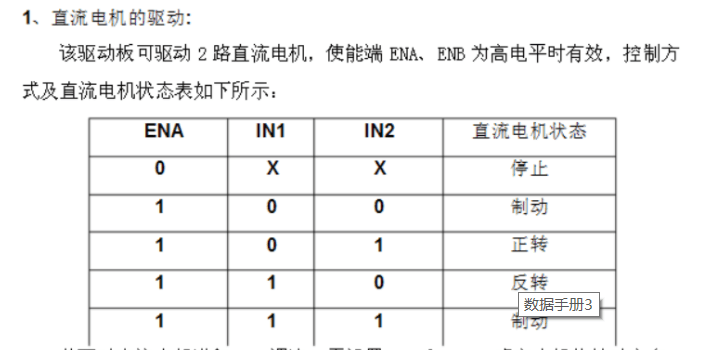

# LN298N驱动模块原理

由L298N的IN1、IN2、IN3、IN4的数据手册，拿右边的电机举例，右边电机用到了IN1、2两个引脚，如果想要电机正
   转，则IN1-->0、IN2-->1，所以IN1给低电平，`digitalWrite(IN[s1],LOW)`;IN2理论上根据手册
   是要给高电平，但是这里电机要调速，所以给的是模拟信号`analogWrite(IN[s2],abs(speed1))`;
   根据模拟信号大小来控制电机速度。

