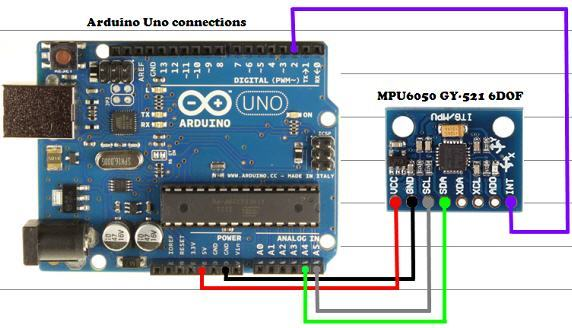
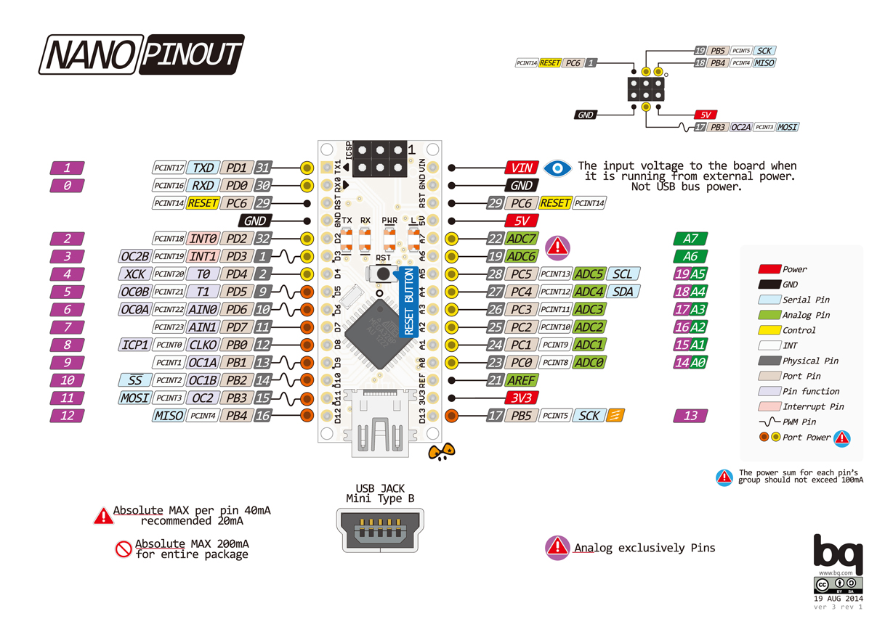

# MPU6050数据获取、分析与处理

引自： <https://zhuanlan.zhihu.com/p/20082486>

## 1. 简介

MPU6050是一种空间运动传感器芯片，可以获取器件当前的三个加速度分量和三个旋转角速度。

MPU6050的数据是有较大噪音的，若不进行滤波会对整个控制系统的精准确带来严重影响。MPU6050芯片内自带了一个数据处理子模块DMP，已经内置了滤波算法，在许多应用中使用DMP输出的数据已经能够很好的满足要求。本文将采用另外一种方法，直接面对原始测量数据，从连线、芯片通信开始一步一步教你如何利Arduino获取MPU6050的数据并进行卡尔曼滤波，最终获得稳定的系统运动状态。

## 2. 实现

### 2.1 Arduino与MPU-6050的通信

我们直接使用集成的MPU6050模块。MPU6050的数据接口用的是**I2C总线协议**，因此我们需要Wire程序库的帮助来实现Arduino与MPU6050之间的通信。请先确认你的Arduino编程环境中已安装Wire库。  

#### 2.1.1 硬件电路连接

关于具体引脚的接法，可以参考Wire库的[官方文档]。在UNO板子上，SDA接口对应的是A4引脚，SCL对应的是A5引脚。MPU6050需要5V的电源，可由UNO板直接供电。按照下图连线。其中**紫色线是中断线，这里用不到，可以不接。**




nano板与UNO的接线基本一致，可参考nano引脚图。




#### 2.1.2 数据寄存器

MPU6050的数据写入和读出均通过其芯片内部的寄存器实现，这些寄存器的地址都是1个字节，也就是8位的寻址空间。其寄存器的详细列表说明书请点击[下载]。

### 2.2 将数据写入MPU-6050

在每次向器件写入数据前要先打开Wire的传输模式，并指定器件的总线地址，MPU6050的总线地址是0x68（AD0引脚为高电平时地址为0x69）。然后写入一个字节的寄存器起始地址，再写入任意长度的数据。这些数据将被连续地写入到指定的起始地址中，超过当前寄存器长度的将写入到后面地址的寄存器中。写入完成后关闭Wire的传输模式。下面的示例代码是向MPU6050的0x6B寄存器写入一个字节0。

```c
Wire.beginTransmission(0x68); //开启MPU6050的传输
Wire.write(0x6B); //指定寄存器地址
Wire.write(0); //写入一个字节的数据
Wire.endTransmission(true); //结束传输，true表示释放总线
```

### 2.3 从MPU-6050读出数据

读出和写入一样，要先打开Wire的传输模式，然后写一个字节的寄存器起始地址。接下来将指定地址的数据读到Wire库的缓存中，并关闭传输模式。最后从缓存中读取数据。下面的示例代码是从MPU6050的0x3B寄存器开始读取2个字节的数据：

```c
Wire.beginTransmission(0x68); //开启MPU6050的传输
Wire.write(0x3B); //指定寄存器地址
Wire.requestFrom(0x68, 2, true); //将输据读出到缓存
Wire.endTransmission(true); //关闭传输模式
int val = Wire.read() << 8 | Wire.read(); //两个字节组成一个16位整数
```

### 2.4 MPU6050的数据格式

我们感兴趣的数据位于0x3B到0x48这14个字节的寄存器中。这些数据会被动态更新，更新频率最高可达1000HZ。下面列出相关寄存器的地址，数据的名称。注意，每个数据都是2个字节。

* 0x3B，加速度计的X轴分量ACC_X
* 0x3D，加速度计的Y轴分量ACC_Y
* 0x3F，加速度计的Z轴分量ACC_Z
* 0x41，当前温度TEMP
* 0x43，绕X轴旋转的角速度GYR_X
* 0x45，绕Y轴旋转的角速度GYR_Y
* 0x47，绕Z轴旋转的角速度GYR_Z

MPU6050芯片的座标系是这样定义的：令芯片表面朝向自己，将其表面文字转至正确角度，此时，以芯片内部中心为原点，水平向右的为X轴，竖直向上的为Y轴，指向自己的为Z轴。见下图：


传感器的具体坐标系表示可参考传感器模块上的标识。

#### 2.4.1 加速度计  

加速度计的三轴分量ACC_X、ACC_Y和ACC_Z均为16位有符号整数，分别表示器件在三个轴向上的加速度，取负值时加速度沿座标轴负向，取正值时沿正向。

三个加速度分量均以重力加速度g的倍数为单位，能够表示的加速度范围，即倍率可以统一设定，有4个可选倍率：2g、4g、8g、16g。以ACC_X为例，若倍率设定为2g（默认），则意味着ACC_X取最小值-32768时，当前加速度为沿X轴正方向2倍的重力加速度；若设定为4g，取-32768时表示沿X轴正方向4倍的重力加速度，以此类推。显然，倍率越低精度越好，倍率越高表示的范围越大，这要根据具体的应用来设定。

我们用f表示倍率，f=0为2g，f=3为16g，设定加速度倍率的代码如下：

```c
Wire.beginTransmission(0x68); //开启MPU-6050的传输
Wire.write(0x1C); //加速度倍率寄存器的地址
Wire.requestFrom(0x68, 1, true); //先读出原配置
unsigned char acc_conf = Wire.read();
acc_conf = ((acc_conf & 0xE7) | (f << 3));
Wire.write(acc_conf);
Wire.endTransmission(true); //结束传输，true表示释放总线
```

再以ACC_X为例，若当前设定的加速度倍率为4g，那么将ACC_X读数换算为加速度的公式为：a<sub>x</sub>=4g * ACC_X / 32768，g可取当地重力加速度。

三个角速度分量均以“度/秒”为单位，能够表示的角速度范围，即倍率可统一设定，有4个可选倍率：250度/秒、500度/秒、1000度/秒、2000度/秒。以GYR_X为例，若倍率设定为250度/秒，则意味着GYR取正最大值32768时，当前角速度为顺时针250度/秒；若设定为500度/秒，取32768时表示当前角速度为顺时针500度/秒。显然，倍率越低精度越好，倍率越高表示的范围越大。

#### 2.4.2 角速度计

绕X、Y和Z三个座标轴旋转的角速度分量GYR_X、GYR_Y和GYR_Z均为16位有符号整数。从原点向旋转轴方向看去，取正值时为顺时针旋转，取负值时为逆时针旋转。

三个角速度分量均以“度/秒”为单位，能够表示的角速度范围，即倍率可统一设定，有4个可选倍率：250度/秒、500度/秒、1000度/秒、2000度/秒。以GYR_X为例，若倍率设定为250度/秒，则意味着GYR取正最大值32768时，当前角速度为顺时针250度/秒；若设定为500度/秒，取32768时表示当前角速度为顺时针500度/秒。显然，倍率越低精度越好，倍率越高表示的范围越大。

我们用f表示倍率，f=0为250度/秒，f=3为2000度/秒，除角速度倍率寄存器的地址为0x1B之外，设定加速度倍率的代码与2.1节代码一致。

以GYR_X为例，若当前设定的角速度倍率为1000度/秒，那么将GRY_X读数换算为角速度（顺时针）的公式为：g<sub>x</sub>=1000 * GYR_X / 32768。

[官方文档]: <https://www.arduino.cc/en/Reference/Wire>
[下载]: <https://www.olimex.com/Products/Modules/Sensors/MOD-MPU6050/resources/RM-MPU-60xxA_rev_4.pdf>

